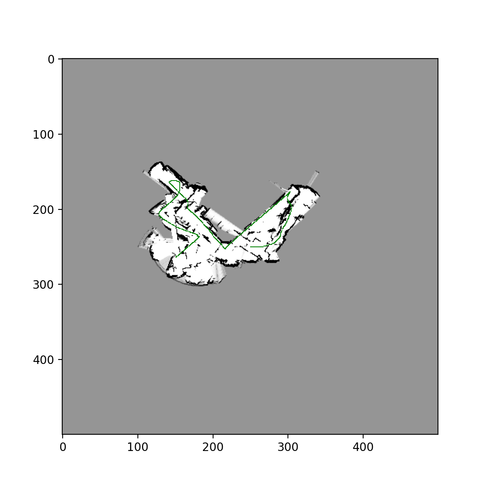

Directory Structure:

- README.md
- code/
  - **dev.py**
  - (supporting .py files)
  - data/
    - (testing and training data)
- results/
  - (save folder for map plots)

Tips:

Run the dev.py module. You can change the output and running conditions in the hyper parameter dictionary at the top of the code. For example, you can turn on live plotting, change the map scale, etc.Assignment 3

----

The SLAM approach uses a Bayes Filter and occupancy grid mapping to approximate a map as well as the robots location in the map. The main components of our state space are the robot position and orientation, as well as the environment. The observations are the lidar data. While the odometer data is also measured, it is considered part of the robot “control”. 

The desired output is : $P(x, m | z, u)$ where $x$ is the robot location, $m$ is the map, and $z$ and $u$ are the observations and control. 

Our “Motion Model” is the likelihood of the current pose given the previous pose: $P(x_t | x_{t-1}, u_t)$. Our basic odometer based “motion model” is simply based on the change is pose (rotation, translation, rotation). Our “Observation Model” is the likelihood of the current sensor observation given the map and pose: $P(z_{t+1} | x_{t+1}, m)$.

Our “Bayes Filter” is essentially made of of these 2 models:

$bel(x_t) = \eta P(z_t|x_t)P(x_t|u_t)$

step 1:

compute right term (the prior), the motion model

step 2:

compute left term, the observation model 

The version of “Bayes Filter” we use is called a “Particle Filter.” Here we use a Monte-Carlo based sampling approach to approximate the state. We sample around the approximate location of the robot, then we test those robots’ observations agreement with our existing environmental representation, and we take the ones that agrees most as our next sample. The map representation is built from the robot sensor readings that agree most with the map. 

Particle Filter:
At each time step t, there is an unknown distribution of the unknown robot-state space. We need to approximate this distribution in order to accurately model uncertainty across time. Rather than approximate the actual function of the robot path (unknowable), we sample from its support. In a sense, we’re roughing it based on a sample from the function space. But how do we know where to sample from?

We approximate that too. Using a “proposed” distribution which is always normal, we sample from that, and then we weigh the samples based on its agreement with our observations (map).

There were many challenges in implementation. The offline, single-robot odometer and mapping approach actually yielded neater looking maps. There was definite imprecision with the robot width, which was difficult to get right. I couldn’t get the particle filter to perform better than the single robot odometer, although theoretically it should perform far better. I believe this is because of imprecision with the robot size. The debugging was also extremely challenging, though was made easier when proper visualization was setup (live plotting of robot path and map). Mapping was done using the occupancy grid approach, adjusting “log odds” up and down arbitrary increments (a hyper parameter). Various hyper parameters were tested, including number of robots, robot size, etc.

**Video for dataset 24, single robot, using SLAM:**

https://drive.google.com/file/d/1-KVdvoq0inn1r_ofRlWdrz5SW31aaTNk/view?usp=sharing

**Training Images for datasets 20, 21, 23, using naive approach:**

**Test image for dataset 22,24, using naive approach:**

**Training images for datasets 20,21 using Particle Filter w/ resampling: **

**Test Images from datasets 22,24 using Particle Filter w/ resampling:**

